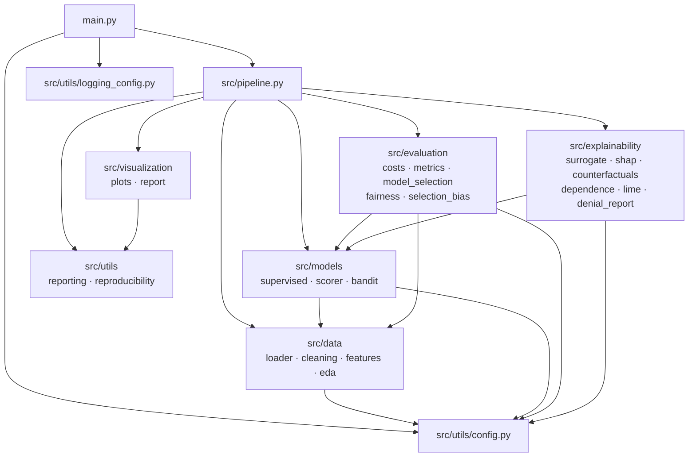
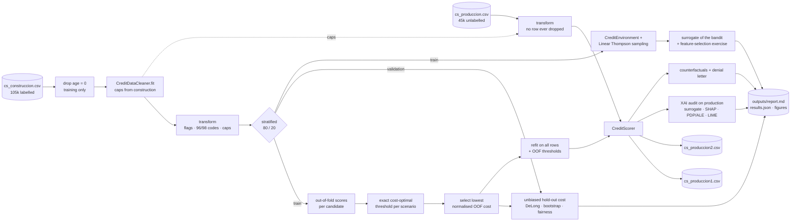
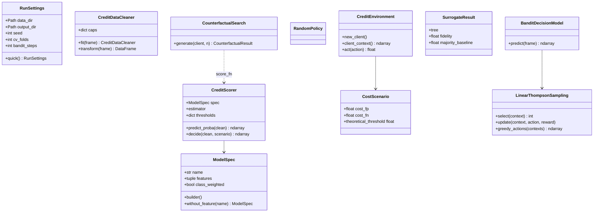

# Architecture

## 1. Project overview

The project builds, optimises and audits a credit-granting model on the
"Give Me Some Credit" data set (`SeriousDlqin2yrs` target). A single
probabilistic model is turned into two decision policies by cost-optimal
thresholds (FP:FN = 1:1 and 1:10), the decisions for the 45,000 production
clients are written to `data/cs_produccion1.csv` / `data/cs_produccion2.csv`,
and the deployed model is audited with XAI techniques (surrogate rules,
SHAP, counterfactuals, PDP/ALE, LIME, fairness), next to a contextual
multi-armed bandit that approaches the same problem through reinforcement
learning.

## 2. Module dependencies



## 3. Data flow



## 4. Main classes



## 5. Key design decisions

| Decision | Why |
|---|---|
| Cleaning never drops production rows; missing income and 96/98 codes become flags | Every production client needs a decision; missingness is informative (5.5% vs 7.0% default rate). The professor dropped these rows in class, which is fine for training only. |
| Thresholds from out-of-fold predictions of the *same* model | The original submission applied a HistGB threshold to an XGBoost model and tuned it on the validation split used to report cost. |
| Model chosen on OOF cost, validation used once | Avoids the optimistic bias of selecting and reporting on the same split. |
| XAI run on the deployed model and on production clients | The audited model must be the one that produced the delivered decisions. |
| Label-dependent analyses (permutation, fairness, bootstrap) on the hold-out model | They need honest, unseen labels. |
| NumPy Thompson-sampling bandit | Same algorithm as `space_bandits.LinearBandits` used in class, without an unmaintained dependency downloaded from Google Drive. |
| Own counterfactual search | Keeps `DebtRatio` consistent with income changes and rebuilds derived features, which DiCE did not. |

## 6. How to run

```bash
python -m venv .venv
.venv\Scripts\activate          # Windows  (Linux/macOS: source .venv/bin/activate)
pip install -r requirements.txt
python main.py                  # ~4 min, regenerates data/cs_produccion{1,2}.csv
pytest                          # unit + integration tests
```

Outputs: `outputs/report.md`, `outputs/reports/results.json`,
`outputs/reports/*.csv`, `outputs/figures/*.png`, `outputs/run.log`.
